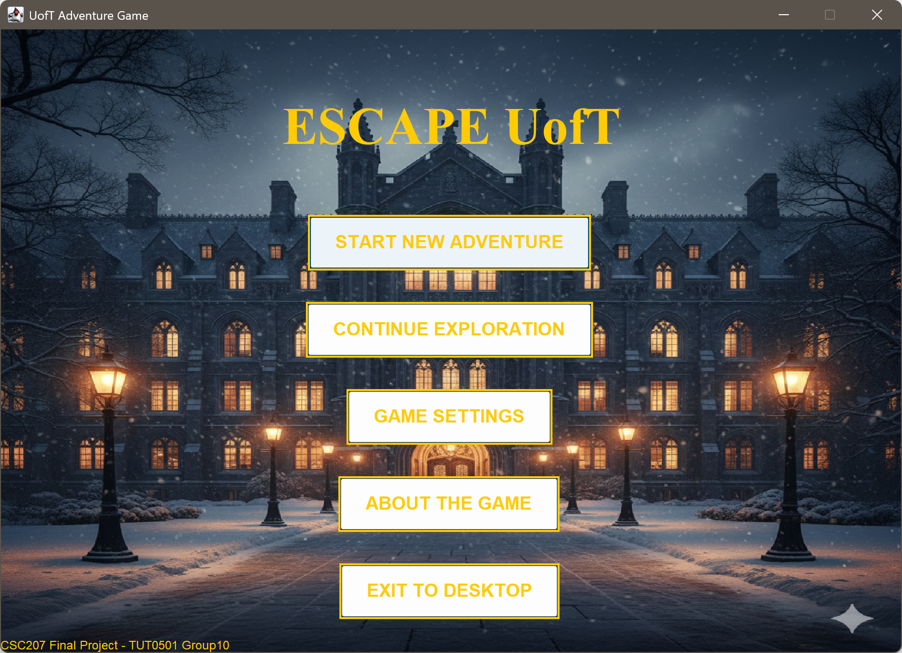
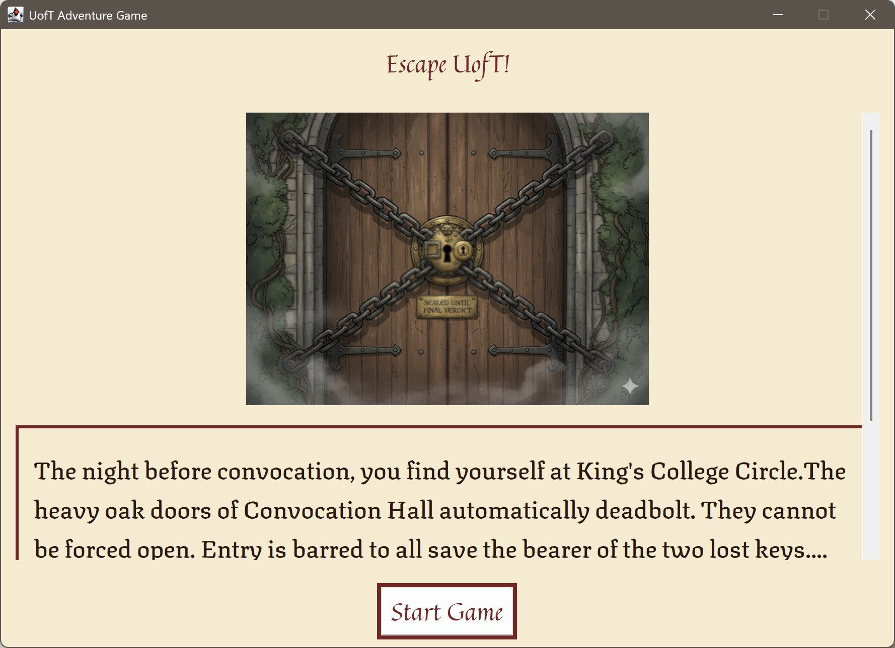
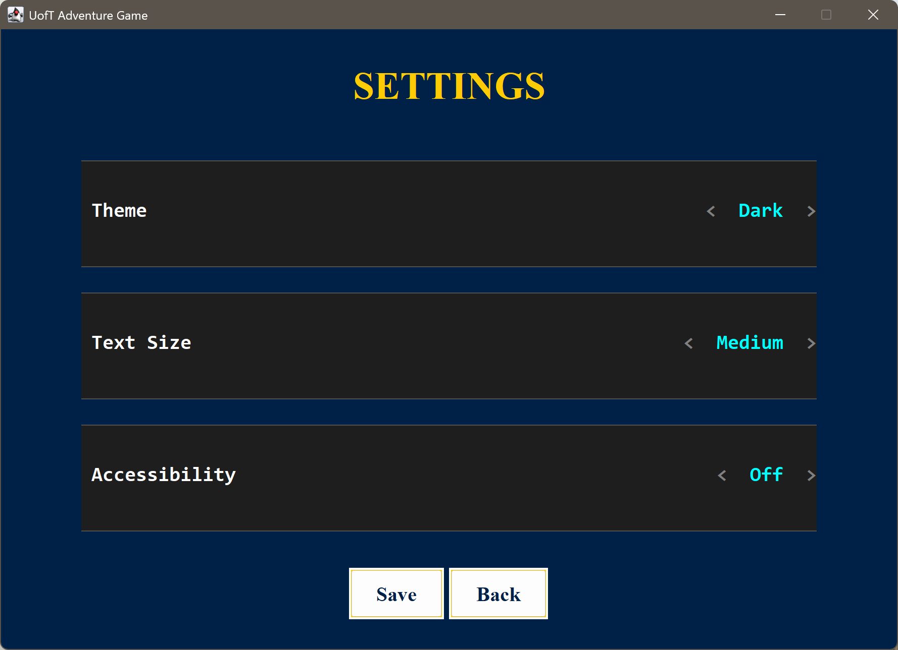
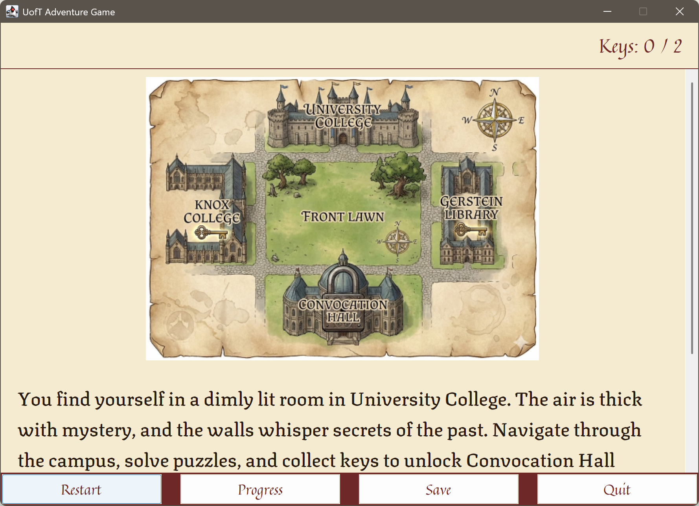
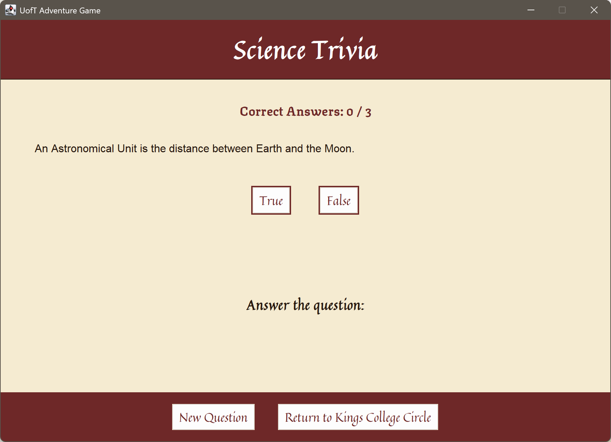
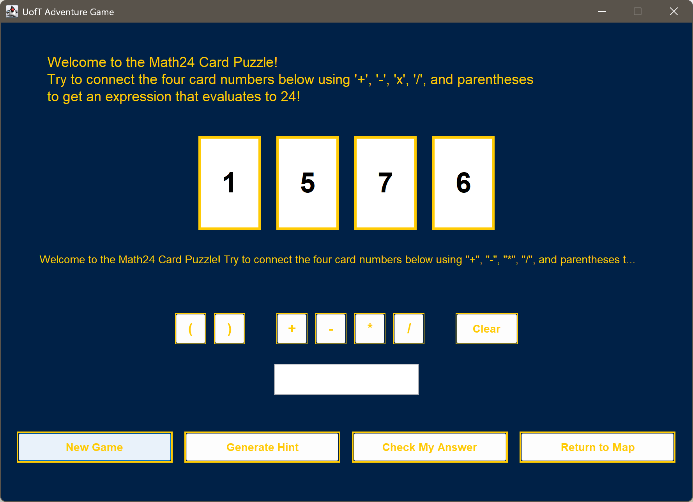

# Escaping UofT: An Adventure Game
- Team: **TUT0501-BA3185-10**

## About
This is a text-based adventure game with Java Swing GUI where players can click buttons to navigate King College's Cricle.
Visit buildings and solve puzzles to collect keys. Player must collect 2 keys before heading to right direction and win the game.

## Use cases
| #             | User story                                                                                                                |          | 
|---------------|---------------------------------------------------------------------------------------------------------------------------|----------|
| User story 1  | As a player, I want to navigate using text commands between different campus locations so I can explore and find puzzles. | Vanessa  |
| User story 2  | As a player, I want to be able to quit from games that are too challenging.                                               | Kimberly |
| User story 3  | As a player, I want to be able to clear my history.                                                                       | Kimberly |
| User story 4  | As a player, I want to be able to save my progress when exiting the game.                                                 | Edison   |
| User story 5  | As a player, I want to be able to view my progress when exploring the game.                                               | Edison   |
| User story 6  | As a player, I want to be able to begin and then complete a playing card puzzle.                                          | Ciny     |
| User story 7  | As a player, I want to be able to be able to interact with the game UI meaningfully                                       | Jean     |
| User story 8  | As a player, I want to be able to begin and then complete a trivia puzzle.                                                | Gabriel  |
| User story 9  | As a player, I want to be able to win (or lose) the game.                                                                 | Gabriel  |
| User story 10 | As a player, I want to customize the game's theme and text size so I can play comfortably.                                | Jean     |
| User story 11 | As a player, I want a clear home screen that lets me start, continue, or adjust settings.                                 | Jean     |

## APIs
Each API will be used for a puzzle within the adventure game. The player will have to complete the puzzle to get a key to unlock the ending of the game. Each puzzle will use an API. The following are our chosen APIs:

### Card Games
Link: https://deckofcardsapi.com/
Notes:
- We were able to get the API working.
- Used for the Math 24 Game 
- rules: https://gamerules.com/rules/twenty-four/

### Trivia:
Link: https://opentdb.com/api_config.php
Notes:
- We were able to get the API working. 
- This is our potential link: https://opentdb.com/api.php?amount=1&category=17&type=boolean
- Configuration: Science and Nature, 1 question, true or false, any difficulty.
- Used for generating random puzzles to escape Gerstein Library

## Screenshots

